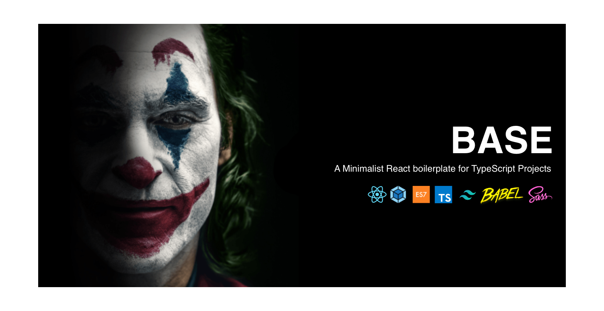

# Base

A Minimalist React boilerplate for TypeScript Projects.

## Demo

<a href="https://base.moquette.us/" rel="Lint to demo"></a>

## Features

- [React 17](https://reactjs.org/)
- [React Router 6](https://reactrouter.com)
- [Webpack 5](https://webpack.js.org)
- [Webpack Bundle Analyzer](https://github.com/webpack-contrib/webpack-bundle-analyzer/)
- [TailwindCSS 3](https://tailwindcss.com)
- [Babel](https://babeljs.io/)
- [Sass](https://sass-lang.com/)
- [TypeScript 4](https://www.typescriptlang.org)
- [Prettier](https://prettier.io) + [ESLint](http://eslint.org) + [Airbnb](https://github.com/airbnb/javascript)
- [Husky](https://typicode.github.io/husky/#/)
- [Lint-staged](https://github.com/okonet/lint-staged#readme)

## Project

I use React.js for almost every front-end project I create. Here's a solid boilerplate I use for modern React TypeScript based projects.

- Base is a lean and imple alternative for CRA (Create React App);
- We can eliminate all of its disadvantages by setting up dependencies and configs ourselves (add dependencies as needed) making it easier to add/modify build configs;
- Minimal webpack and babel configs required to run a react application;
- Production-ready build set up, with linters and pre-commit hooks.
- Support for both JSX and TSX

## Usage

Clone:

```bash
git clone https://github.com/moquette/base.git
```

## Development

1: Change to project directory

```bash
cd base
```

2: Install dependencies

```
yarn
```

3: Start development server

```
yarn start
```

Pages served from http://localhost:3000 and [HMR](https://webpack.js.org/concepts/hot-module-replacement/) enabled.

**NOTE:**
Auto type checking, linting and formatting performed on pre-commit.

## Deployment

Build:

```bash
yarn build
```

The build will be placed in the `build` directory. You can change the build directory in the webpack config.

## Universal Alias

(Absolute Path Importing)

File import can use either relative or absolute paths with the **@/** universal alias:

**Relative Importing**

```typescript
import { EmailJS } from '../../components/EmailJS'
```

**Universal Alias Importing**

```typescript
import { EmailJS } from '@/components/EmailJS'
```

## Sass and TailwindCSS

Sass and TailwindCSS are both supported.

`tailwind.config.js` is located in the project's root an initialzed in `styles/global.scss` . Visit [TailwindCSS](https://tailwindcss.com/docs/configuration) for more information.

## Scripts

**yarn start:**

Start development server and lanches default browser.

**yarn build:**

Builds and bundles resources for production.

**yarn type-check:**

Validates code with TypeScript compiler.

**yarn lint:**

Runs ESLint and on all files in the `src` directory.

**yarn format:**

Runs Prettier formatting on all files in the `src` directory.

**yarn commit:**

Runs commitizen, an alternative to `git commit`.

**yarn update-dependencies:**

Checks for and updates package dpendencies.

**yarn analyzer:**

Visualize size of webpack output files with an interactive zoomable treemap.

## Yarn / NPM

This boilerplate uses [Yarn 3](https://yarnpkg.com) by default. Nonetheless, you may switch to npm by deleting the `yarn.lock` file, and installing dependencies with `npm install`. Remember to change any CI workflows, Husky Git hooks, and lint-staged steps to use npm commands.

## License

This project is open source and available under the [MIT License](LICENSE).
